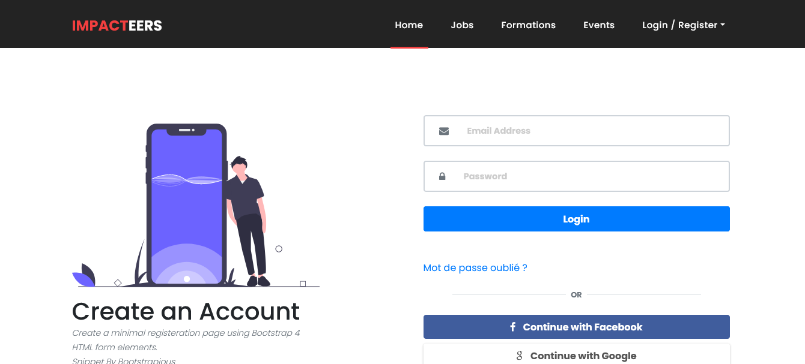
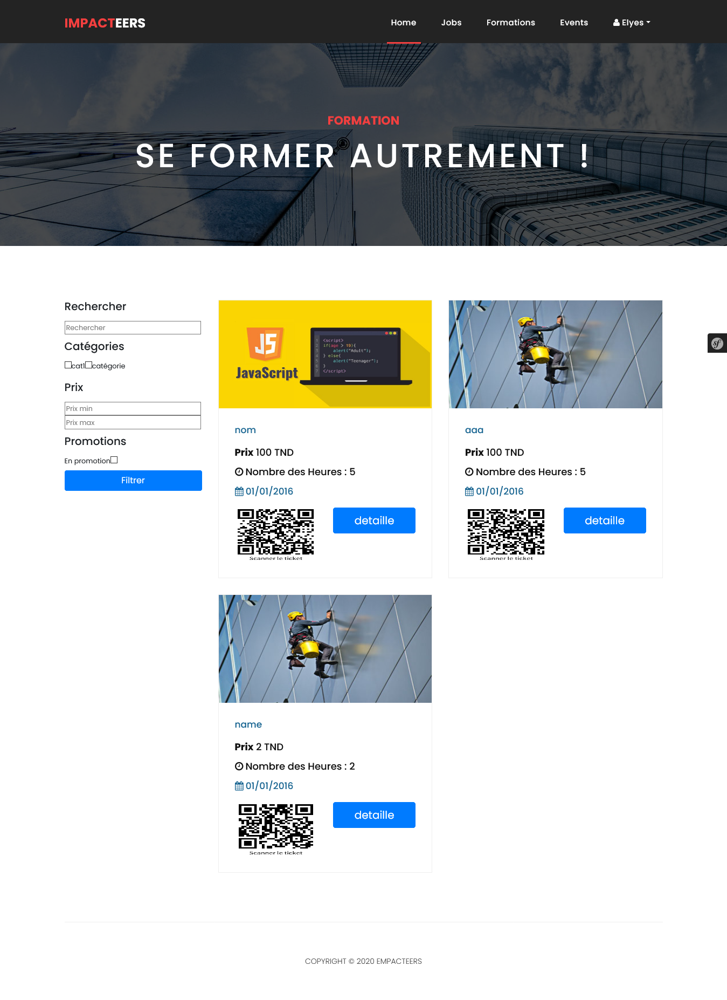

# Symfony 4 : Recruitement website
## About The Project

This website allows users to apply in different job/internship offers and allows admins to create quizes which clients should take in order to apply in certain offers.

Mobile version - [CodeNameOne-RecruitementApp](https://github.com/ElyesAkkari/CodeNameOne-RecruitementApp)

(<a href="#top">back to top</a>)

## Contact

Elyes Akkari - [Linkedin](https://www.linkedin.com/in/elyes-akkari-26013a1b9/)

GitHub: [Elyes Akkari](https://github.com/ElyesAkkari)

(<a href="#top">back to top</a>)

